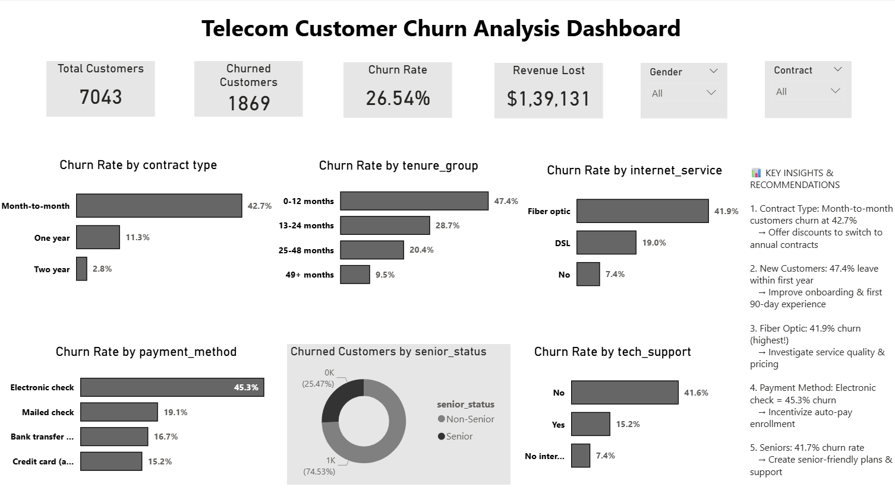

# 📊 Telecom Customer Churn Analysis

A comprehensive data analysis project identifying factors driving customer churn in a telecom company and providing actionable retention strategies.

---

## 📋 Table of Contents
- [Business Problem](#business-problem)
- [Objective](#objective)
- [Dataset](#dataset)
- [Tools Used](#tools-used)
- [Key Findings](#key-findings)
- [Recommendations](#recommendations)
- [Dashboard Features](#dashboard-features)
- [SQL Queries](#sql-queries)
- [How to Use](#how-to-use)
- [Author](#author)

---

## ❓ Business Problem

A telecom company is experiencing high customer churn, leading to:
- Loss of recurring revenue
- High cost of acquiring new customers (5x more expensive than retention)
- Competitive disadvantage in the market

**The company needs to understand:**
1. WHO is leaving?
2. WHY are they leaving?
3. HOW can we stop them?

---

## 🎯 Objective

Analyze customer data to:
- Calculate overall churn rate
- Identify key factors driving churn
- Segment high-risk customers
- Provide data-driven retention strategies
- Quantify revenue impact of churn

---

## 📁 Dataset

- **Source:** [Kaggle - Telco Customer Churn](https://www.kaggle.com/datasets/blastchar/telco-customer-churn)
- **Records:** 7,043 customers
- **Features:** 21 columns including demographics, services, contract details, and churn status

### Key Variables:
| Variable | Description |
|----------|-------------|
| `customerID` | Unique customer identifier |
| `tenure` | Months with the company |
| `Contract` | Month-to-month, One year, Two year |
| `MonthlyCharges` | Monthly payment amount |
| `Churn` | Whether customer left (Yes/No) |

---

## 🛠️ Tools Used

| Tool | Purpose |
|------|---------|
| **PostgreSQL** | Data storage, cleaning, and analysis |
| **Power BI** | Data visualization and dashboard creation |
| **DAX** | Calculated measures and KPIs |

---

## 🔍 Key Findings

### Overall Churn
| Metric | Value |
|--------|-------|
| Total Customers | 7,043 |
| Churned Customers | 1,869 |
| **Churn Rate** | **26.54%** |
| Monthly Revenue Lost | **$139,131** |

### Churn by Contract Type
| Contract | Churn Rate |
|----------|------------|
| Month-to-month | **42.7%** 🔴 |
| One year | 11.3% 🟡 |
| Two year | 2.8% 🟢 |

**Insight:** Month-to-month customers are **15x more likely to churn** than two-year contract customers!

### Churn by Tenure
| Tenure | Churn Rate |
|--------|------------|
| 0-12 months | **47.4%** 🔴 |
| 13-24 months | 28.7% 🟠 |
| 25-48 months | 20.4% 🟡 |
| 49+ months | 9.5% 🟢 |

**Insight:** Nearly **half of new customers leave within the first year!**

### Churn by Internet Service
| Service | Churn Rate |
|---------|------------|
| Fiber optic | **41.9%** 🔴 |
| DSL | 19.0% 🟡 |
| No internet | 7.4% 🟢 |

**Insight:** Premium fiber optic customers have the highest churn — potential service quality or pricing issue.

### Churn by Payment Method
| Payment Method | Churn Rate |
|----------------|------------|
| Electronic check | **45.3%** 🔴 |
| Mailed check | 19.1% 🟡 |
| Bank transfer (auto) | 16.7% 🟢 |
| Credit card (auto) | 15.2% 🟢 |

**Insight:** Electronic check users churn at **3x the rate** of auto-pay customers!

### Churn by Tech Support
| Tech Support | Churn Rate |
|--------------|------------|
| No | **41.6%** 🔴 |
| Yes | 15.2% 🟢 |

**Insight:** Customers without tech support are **3x more likely to churn!**

---

## 💡 Recommendations

| # | Recommendation | Expected Impact |
|---|----------------|-----------------|
| 1 | **Incentivize Annual Contracts** — Offer discounts for switching from month-to-month | Reduce churn by 10-15% |
| 2 | **Improve Onboarding** — Focus on first 90-day customer experience | Retain more new customers |
| 3 | **Investigate Fiber Optic** — Audit service quality and pricing competitiveness | Address premium customer concerns |
| 4 | **Encourage Auto-Pay** — Offer discount for automatic payment enrollment | Reduce payment friction |
| 5 | **Promote Tech Support** — Bundle tech support with internet packages | Reduce support-related churn |
| 6 | **Senior-Friendly Plans** — Create simplified plans with dedicated support | Address 41.7% senior churn rate |

**Potential Savings:** Reducing churn by 5% could save **$500K+ annually**

---

## 📈 Dashboard Features

- **4 KPI Cards:** Total Customers, Churned Customers, Churn Rate, Revenue Lost
- **6 Visualizations:**
  - Churn Rate by Contract Type
  - Churn Rate by Tenure Group
  - Churn Rate by Internet Service
  - Churn Rate by Payment Method
  - Churn Rate by Tech Support
  - Churned Customers by Senior Status
- **2 Interactive Slicers:** Gender, Contract Type
- **Key Insights Panel:** Business recommendations

---

## 📝 SQL Queries

The analysis includes the following SQL queries:

1. **Overall Churn Distribution**
2. **Churn Rate by Contract Type**
3. **Churn Rate by Tenure Group**
4. **Churn Rate by Internet Service**
5. **Churn Rate by Payment Method**
6. **Revenue Impact Analysis**
7. **Churn Rate by Senior Status**
8. **View Creation for Power BI**

See [`churn_analysis.sql`](churn_analysis.sql) for complete queries.

---

## 🚀 How to Use

### Prerequisites
- PostgreSQL (pgAdmin4)
- Power BI Desktop
- Dataset from Kaggle

### Steps
1. Clone this repository
2. Import the dataset into PostgreSQL
3. Run the SQL queries from `churn_analysis.sql`
4. Export the view to CSV
5. Open `Telecom_Churn_Dashboard.pbix` in Power BI
6. Refresh data connection if needed

---

## 👤 Author

**Shubhangi Pawar**

- 📧 Email: ishubhangipawar@gmail.com
- 💼 LinkedIn: linkedin.com/in/shubhangipawar18
- 🌐 GitHub: github.com/shubhangipawar18

### Background
Former SNOC Engineer at Vodafone with 2+ years of telecom operations experience. Now combining domain expertise with data analytics skills to drive business insights.

---

## 🙏 Acknowledgments

- Dataset: [IBM Sample Data via Kaggle](https://www.kaggle.com/datasets/blastchar/telco-customer-churn)
- Tools: PostgreSQL, Power BI

---

⭐ **If you found this project useful, please give it a star!**

